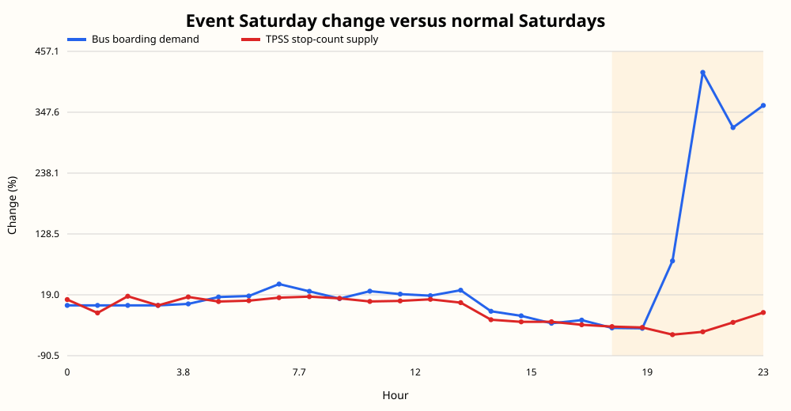
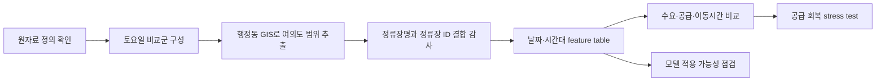
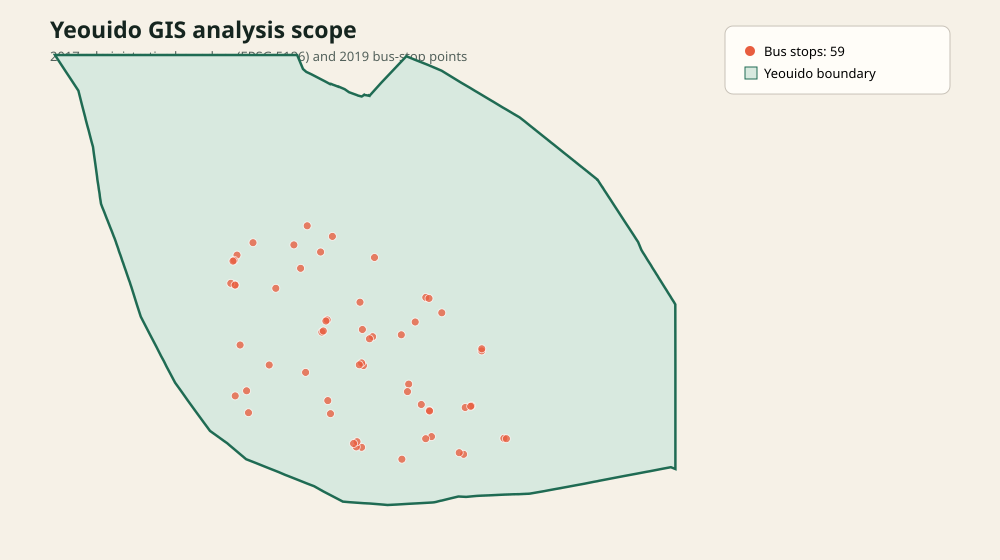
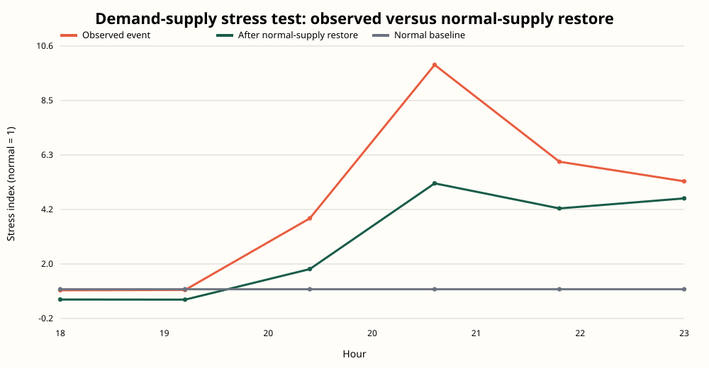

# 여의도 불꽃축제 교통 수요와 공급 분석

2023년 10월 7일 서울세계불꽃축제를 사례로, 행사 종료 전후 여의도에서 대중교통 수요와 버스 공급이 어떻게 달라졌는지 분석했습니다. SKT OD와 체류인구, 서울시 버스·지하철 30분 이용 자료, TPSS 정차횟수, 행정동 GIS를 시간대별로 결합했습니다.

[결과 페이지](index.html) | [분석 방법](docs/METHODOLOGY.md) | [feature 정의](docs/FEATURE_CATALOG.md) | [모델 선택 기준](docs/MODEL_SELECTION.md)



## 30초 요약

- 문제: 행사 종료 후 버스 이용 수요는 늘지만 정류장 정차횟수는 오히려 줄어드는지 확인했습니다.
- 비교: 행사일과 같은 토요일만 사용했습니다. 추석 연휴 토요일은 기본 비교군에서 제외했습니다.
- 결과: 18시부터 23시까지 버스 승차 관측치는 평상시보다 142.4% 높았고 TPSS 정차횟수는 37.4% 낮았습니다.
- 이동시간: 같은 시간대 여의도 출발 버스 OD 가중평균 이동시간은 31.99분 길었습니다.
- 구현: 원자료 로딩, GIS 범위 추출, 시간 집계, join audit, feature table, 시나리오 계산, SVG 생성, 공개 데이터 재현과 CI 검증을 코드로 만들었습니다.

## 분석 결과

분석 시간은 행사 종료 전후인 18시부터 23시입니다. 이 구간은 행사 운영 맥락을 기준으로 정했으며 데이터에서 자동 탐지한 시간이 아닙니다.

| 지표 | 행사일 | 정상 토요일 평균 | 차이 |
|---|---:|---:|---:|
| 여의도 출발 버스 OD 가중평균 이동시간 | 64.60분 | 32.62분 | +31.99분 |
| 여의도 출발 버스 OD 통행량 | 8,600 | 1,442.8 | +7,157.2 |
| 여의도 버스 승차 관측치 | 25,626 | 10,570.3 | +142.4% |
| 여의도 4개 역 지하철 승차 관측치 | 36,346 | 12,532.0 | +190.0% |
| 여의도 GIS 정류장 TPSS 정차횟수 | 5,973 | 9,544.7 | -37.4% |
| 여의도 체류인구 시간대 관측치 합계 | 1,078,516 | 389,436.8 | +689,079.2 |

버스와 지하철 수치는 1회용 카드 이용 관측치입니다. 전체 승객수로 환산하지 않고 같은 자료 안에서 행사일과 평상시의 상대 차이만 비교했습니다. 체류인구 합계도 고유 방문자 수가 아니라 시간대별 관측치의 합입니다.

## 문제를 푼 순서



### 1. 비교군을 다시 구성했습니다

행사일은 토요일인데 초기 분석의 비교 날짜는 일요일이었습니다. 비교군을 다음과 같이 다시 만들었습니다.

- OD와 체류인구: 2023-09-02, 09-09, 09-16, 09-23, 10-14
- 버스, 지하철, TPSS: 2023-10-14, 10-21, 10-28
- 2023-09-30: 추석 연휴 영향 가능성이 있어 민감도 분석에만 사용

### 2. 행 평균이 아니라 통행량 가중평균을 사용했습니다

OD 행마다 평균 이동시간과 통행량 `od_cnts`가 함께 있습니다. 통행량이 다른 행을 같은 비중으로 평균하지 않도록 다음 식을 적용했습니다.

```text
가중평균 이동시간 = Σ(od_duration_avg × od_cnts) / Σ(od_cnts)
```

정상 토요일도 날짜별 평균을 다시 평균하지 않고, 비교 날짜의 가중 이동시간과 통행량을 합쳐 pooled average를 계산했습니다. OD 이동시간에는 정류장 대기시간이 별도 변수로 분리되어 있지 않습니다.

### 3. GIS와 교통자료의 결합 품질을 확인했습니다

2017년 행정동 경계에서 여의동 폴리곤을 읽고 2019년 버스정류장 포인트를 point-in-polygon으로 추출했습니다.

- 여의동 내부 정류장: 59개 ID, 40개 고유 정류장명
- 버스 30분 자료의 행사일 정류장명 커버리지: 32/40, 80.0%
- TPSS 정류장 ID 매칭: 54/59, 91.5%
- 지하철: 설정한 4개 역 모두 관측

중복 정류장명은 여의도 전체 합계에는 포함했지만 임의 좌표에는 배정하지 않았습니다. 매칭률과 제외 사유는 [join audit](outputs/tables/join_audit.csv)에 기록했습니다.



### 4. 30분 집계 오류를 찾아 수정했습니다

첫 공개 후보를 검토하는 과정에서 `HALF_HOUR=30` 행이 제외된 사실을 발견했습니다. 시각을 읽는 함수가 0부터 23까지만 허용해 30분 값을 잘못 처리한 것이 원인이었습니다.

시간 파서와 30분 파서를 분리하고 버스와 지하철 패널이 `0`, `30` 두 구간을 모두 포함하는지 테스트했습니다. README와 공개 집계본의 수치도 원자료에서 다시 계산했습니다. 수정 내용은 [CORRECTIONS.md](docs/CORRECTIONS.md)에 남겼습니다.

## Feature engineering과 모델 선택

[actual_hourly_feature_table.csv](data/public/actual_hourly_feature_table.csv)는 다음 변수를 시간대별 한 행으로 정리합니다.

- 여의도 출발 버스 OD 통행량과 가중평균 이동시간
- 여의도 체류인구
- 버스와 지하철 승차 관측치
- TPSS 정차횟수
- 행사일과 정상 토요일의 차이
- 승차 관측치 대비 정차횟수 stress index

예측 목표는 여의도 출발 버스 통행의 추가 이동시간으로 설정할 수 있습니다. 다만 모든 데이터 소스가 동시에 존재하는 날짜는 2023-10-07과 2023-10-14 두 날뿐입니다. 시간 행을 무작위로 나누면 같은 날짜가 학습과 평가 데이터에 섞여 성능이 부풀려집니다. 그래서 이 저장소에는 예측 점수를 공개하지 않았습니다.

날짜가 더 확보되면 다음 순서로 비교하도록 설계했습니다.

| 후보 | 용도 |
|---|---|
| Ridge | 해석 가능한 기준 모델 |
| Gradient Boosting | 수요와 공급의 비선형 관계를 다루는 주 후보 |
| Random Forest | 비선형 결과의 방향을 비교하는 보조 모델 |
| SVR | 표본 확대 후 scaling을 적용한 추가 비교 |

검증은 시간 행 무작위 분할이 아니라 날짜 전체를 holdout하는 방식으로 진행합니다. 평가 기준은 분 단위 MAE이며 정상 토요일 평균보다 오차가 낮은지 함께 확인합니다. 상세한 판단 근거는 [MODEL_SELECTION.md](docs/MODEL_SELECTION.md)와 [model_readiness.json](outputs/reports/model_readiness.json)에 있습니다.

## 공급 회복 시나리오

버스 승차 관측치를 수요, TPSS 정차횟수를 공급 지표로 놓고 시간대별 부담을 계산했습니다.

```text
수요/공급 부담 = 버스 승차 관측치 / TPSS 정차횟수
stress index = 행사일 부담 / 정상 토요일 부담
```

18시부터 23시까지 합계 기준 결과는 다음과 같습니다.

- 관측된 행사일 stress index: 3.87배
- 정차횟수를 평상시 수준으로 회복한 뒤: 2.42배
- 행사일과 평상시의 정차횟수 차이: 3,571.7회 지표



이 계산은 평상시 수준의 정차횟수를 회복해도 수요가 유지되면 단위 공급당 부담이 남는다는 설명적 시나리오입니다. 실제 버스 대수, 좌석 공급, 최적 배차 또는 정책 시행 효과를 뜻하지 않습니다.

## 직접 구현한 내용

- 하루 약 330만에서 380만 행인 SKT OD와 체류인구 CSV를 순차적으로 읽어 필요한 범위만 집계했습니다.
- 외부 GIS 패키지 없이 SHP와 DBF를 읽고 EPSG:5186 좌표에서 여의동 정류장을 추출했습니다.
- 정류장명 결합과 정류장 ID 결합을 분리하고, 결합률과 제외 사유를 표로 만들었습니다.
- 버스와 지하철 30분 자료를 시간 단위로 합성했습니다.
- 행사일, 정상 토요일, 단일 검산일을 한 표에서 비교할 수 있게 만들었습니다.
- 공개 가능한 시간대 집계본과 원자료용 전체 실행 경로를 분리했습니다.
- SVG 결과 그림과 정적 HTML 요약 페이지를 코드에서 생성했습니다.
- 단위 테스트와 GitHub Actions로 30분 구간, 날짜 조건, 링크, 개인정보 경로를 검사했습니다.

## 실행 방법

Python 3.10 이상만 필요합니다. 공개 집계본을 이용한 재현에는 외부 패키지가 필요하지 않습니다.

```powershell
python reproduce_public.py
python -m unittest discover -s tests
python validate_release.py
```

원자료가 상위 작업 폴더에 있는 경우 전체 로딩과 결합부터 다시 실행할 수 있습니다.

```powershell
$env:FORCE_REBUILD = "1"
python run_all.py
Remove-Item Env:FORCE_REBUILD
```

## 저장소 안내

```text
src/                    원자료 로딩, 공간 추출, 결합, 분석, 시각화
tests/                  시간 파서와 시나리오 단위 테스트
data/public/            공개 가능한 날짜·시간대 집계본
outputs/tables/         분석표와 join audit
outputs/figures/        실제 결과 SVG
outputs/reports/        재분석 요약, 모델 준비도, 공개 검증 결과
docs/                   분석 방법, 데이터 사전, 수정 이력
index.html              정적 결과 요약 페이지
reproduce_public.py     공개 집계본 기반 결과 재생성
run_all.py              원자료 기반 전체 실행
validate_release.py     공개 전 일관성 검사
```

## 해석 범위

- 행사일과 정상 토요일의 기술통계 비교입니다. 인과효과로 해석하지 않습니다.
- 도로통제, 우회, 무정차의 개별 영향을 확인할 운영자료는 결합하지 않았습니다.
- 버스와 지하철 관측치는 전체 승객수가 아닙니다.
- 2017년 행정동 경계와 2019년 정류장 자료를 2023년 교통자료에 적용했습니다.
- 공덕, 당산, 노량진 환승거점 셔틀은 후속 정책 아이디어입니다. 이 저장소는 거점의 최적성, 차량 대수, 비용, 수송인원, 시간 절감 효과를 검증하지 않습니다.

주장별 근거와 해석 제한은 [CLAIM_EVIDENCE_MAP.md](CLAIM_EVIDENCE_MAP.md), 공개 데이터 정의는 [DATA_DICTIONARY.md](docs/DATA_DICTIONARY.md)에서 확인할 수 있습니다.
