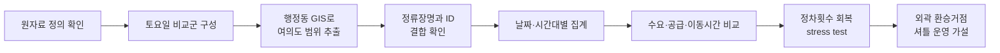
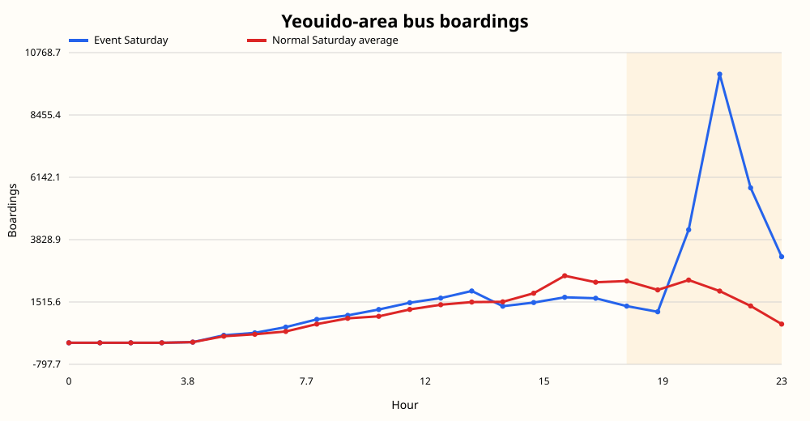

<div align="center">

# Yeouido Festival Mobility Analysis

**여의도 불꽃축제 뒤 길어진 귀가를 수요·운행·이동시간으로 진단하고, 외곽 환승거점 셔틀을 운영 가설로 제안했습니다.**

[결과 페이지](https://yoon-chan-hyeok.github.io/yeouido-festival-mobility-analysis/) · [분석 방법](docs/METHODOLOGY.md) · [데이터 출처](docs/DATA_PROVENANCE.md) · [변수 정의](docs/FEATURE_CATALOG.md) · [모델 선택 기준](docs/MODEL_SELECTION.md)

[](https://github.com/yoon-chan-hyeok/yeouido-festival-mobility-analysis/actions/workflows/validate.yml)

[문제](#1-관찰에서-분석-질문으로) · [설계](#2-왜-여러-데이터를-같이-봤는가) · [방법](#3-데이터를-어떻게-맞췄는가) · [결과](#4-확인한-결과) · [운영 가설](#5-분석에서-운영-가설로) · [검증](#6-분석을-다시-검증한-과정) · [실행](#8-실행-방법)

</div>

> **졸업작품 최종 공개본입니다.** 초기 분석과 합성 데이터 기반 파이프라인은
> [event-traffic-delay-analysis](https://github.com/yoon-chan-hyeok/event-traffic-delay-analysis)에
> 이전 단계로 보존했습니다. 두 저장소는 별도 프로젝트가 아니라, 같은 문제를 처음 분석한 기록과
> 실제 데이터를 다시 검증한 최종 결과의 관계입니다.

## 1. 관찰에서 분석 질문으로

2023년 10월 7일 서울세계불꽃축제를 보고 돌아오는 길에 평소보다 귀가 시간이 오래 걸렸습니다. 처음에는 방문객이 많아서 생긴 혼잡이라고 생각했습니다. 하지만 수요가 얼마나 늘었는지, 같은 시간에 대중교통은 얼마나 운행됐는지, 실제 이동시간은 얼마나 길어졌는지를 나누어 보지 않으면 귀가 지연을 설명하기 어려웠습니다.

분석 질문을 세 가지로 정리했습니다.

1. 행사 종료 뒤 여의도에서 빠져나가는 수요는 평소 토요일보다 얼마나 늘었는가?
2. 수요가 몰린 시간에 버스와 지하철 이용, 버스 정차횟수는 어떻게 달라졌는가?
3. 수요와 운행 변화가 함께 나타난 시간에 여의도 출발 이동시간은 얼마나 길어졌는가?

이 질문을 확인하기 위해 SKT OD와 체류인구, 서울시 버스·지하철 30분 이용 자료, TPSS 정차횟수와 행정동 GIS를 시간대별로 결합했습니다.

분석 결과를 바탕으로 여의도 안에 버스를 더 넣는 방안보다, 귀가 수요를 공덕, 당산과 노량진의 외곽 환승거점으로 옮기는 셔틀 운영안을 제안했습니다. 이 저장소에서는 데이터로 확인한 결과와 아직 검증하지 못한 운영 가설을 구분합니다. 서울시립대학교 교통공학과 졸업작품으로 진행했습니다.

| 분석 조건 | 설정 |
|---|---|
| Event | 2023-10-07 서울세계불꽃축제 |
| Spatial scope | 여의동 행정경계 내부와 여의도 출발 bus OD |
| Event window | 행사 종료 전후인 18시부터 23시 |
| Control | 같은 요일인 정상 토요일, 추석 연휴는 sensitivity analysis로 분리 |
| Analysis type | Descriptive comparison, data-quality audit와 supply recovery stress test |

## 2. 왜 여러 데이터를 같이 봤는가

한 가지 데이터만 보면 방문객이 늘었다는 사실과 교통 운영 상태가 섞여 보입니다. 그래서 수요, 공급과 이동 결과를 서로 다른 자료에서 확인한 뒤 같은 시간축에 맞췄습니다.

| 판단 | 분석에 반영한 방식 |
|---|---|
| 행사 시작 전 유입과 종료 뒤 유출은 성격이 다릅니다. | 도착 통행은 `end_time`, 출발 통행은 `start_time`으로 집계하고, 최종 분석은 18시부터 23시까지의 여의도 출발 통행에 맞췄습니다. |
| 행사일 절대값만으로는 평소보다 얼마나 달라졌는지 알 수 없습니다. | 같은 요일인 정상 토요일을 기준으로 차이와 비율을 계산했습니다. |
| OD, 승차 관측치와 정차횟수는 단위가 서로 다릅니다. | 하나의 점수로 억지로 합치지 않고 각 자료를 평상시 기준과 비교한 뒤 함께 해석했습니다. |
| 평균 이동시간은 통행량이 다른 OD 행의 영향을 받아야 합니다. | `od_cnts`를 가중치로 사용한 가중평균 이동시간을 계산했습니다. |
| 예측 결과처럼 보이는 수치는 검증 자료가 충분해야 합니다. | 행사 토요일이 한 건뿐인 현재 공개본에서는 predictive score를 제외하고 기술통계와 stress test만 남겼습니다. |

분석 과정에서 정류장명과 ID 결합률, GIS 범위와 30분 집계 누락도 따로 점검했습니다. 비교 날짜는 같은 토요일로 맞췄고 추석 연휴 토요일은 기본 비교군에서 제외했습니다.


## 3. 데이터를 어떻게 맞췄는가

| 자료 | 분석에 사용한 값 |
|---|---|
| SKT OD | 여의도 출발 통행량과 통행량 가중평균 이동시간 |
| SKT 체류인구 | 시간대별 여의도 체류 관측치 |
| 버스·지하철 30분 자료 | 정류장과 4개 역의 승차 관측치 |
| TPSS | 여의도 정류장의 시간대별 정차횟수 |
| 행정동 GIS | 여의동 안에 있는 정류장과 역의 공간 범위 |

SKT 자료는 2024 AI·데이터 분석활용 빅콘테스트 데이터 분석 분야 제공 자료입니다. 버스·지하철 자료와 버스정류장 GIS는 서울시 빅데이터캠퍼스, TPSS는 서울열린데이터광장에서 제공됩니다. 공식 링크와 원자료 공개 범위는 [DATA_PROVENANCE.md](docs/DATA_PROVENANCE.md)에 정리했습니다.



행사일은 토요일이므로 비교군도 토요일로 맞췄습니다.

- OD와 체류인구: 2023-09-02, 09-09, 09-16, 09-23, 10-14
- 버스, 지하철, TPSS: 2023-10-14, 10-21, 10-28
- 2023-09-30: 추석 연휴 영향 가능성이 있어 민감도 분석에만 사용

분석 시간은 행사 종료 전후인 18시부터 23시입니다. 행사 운영 시간을 보고 정한 구간이며 데이터에서 자동으로 찾은 시간은 아닙니다.

## 4. 확인한 결과

| 지표 | 행사일 | 정상 토요일 평균 | 차이 |
|---|---:|---:|---:|
| 여의도 출발 버스 OD 가중평균 이동시간 | 64.60분 | 32.62분 | +31.99분 |
| 여의도 출발 버스 OD 통행량 | 8,600 | 1,442.8 | +7,157.2 |
| 여의도 버스 승차 관측치 | 25,626 | 10,570.3 | +142.4% |
| 여의도 4개 역 지하철 승차 관측치 | 36,346 | 12,532.0 | +190.0% |
| 여의도 GIS 정류장 TPSS 정차횟수 | 5,973 | 9,544.7 | -37.4% |
| 여의도 체류인구 시간대 관측치 합계 | 1,078,516 | 389,436.8 | +689,079.2 |

버스와 지하철 수치는 1회용 카드 이용 관측치입니다. 전체 승객수로 환산하지 않고 같은 자료 안에서 행사일과 평상시의 차이만 비교했습니다. 체류인구 합계도 고유 방문자 수가 아니라 시간대별 관측치의 합입니다.

<p align="center">
  
  
</p>

행사일에는 이동과 대중교통 이용 수요가 크게 늘었지만 버스 정차횟수는 줄었습니다. 이 결과만으로 개별 원인이나 정책 효과를 확정할 수는 없습니다. 다만 귀가 지연을 수요 증가 하나로만 설명하기보다, 같은 시간대의 공급 변화도 함께 봐야 한다는 점은 확인할 수 있었습니다.

## 5. 분석에서 운영 가설로

외곽 환승거점 셔틀은 수요·운행 불균형을 확인한 뒤 제안한 운영안입니다. 행사 종료 뒤 여의도 안에서 수요가 급증한 반면, 같은 시간대 TPSS 정차횟수는 감소했습니다. 먼저 정차횟수만 평상시 수준으로 돌아온다고 가정해 버스 이용 부담이 얼마나 남는지 계산했습니다.

```text
수요/운행 부담 = 버스 승차 관측치 / TPSS 정차횟수
부담 지수 = 행사일 부담 / 정상 토요일 부담
```

18시부터 23시까지 관측된 부담 지수는 평상시의 3.87배였습니다. 정차횟수를 평상시 수준으로 바꿔도 2.42배가 남았습니다. 이 결과는 증차 효과를 예측한 값이 아니라, 행사일 수요가 그대로라면 관측 정차횟수의 회복만으로 평상시 부담까지 돌아가기 어렵다는 산술적 점검입니다.


이 점검을 바탕으로 발표에서는 저혼잡 구간에 셔틀을 미리 대기시키고 공덕·당산·노량진역까지 수요를 옮기는 방안을 제안했습니다. 귀가 수요가 집중되는 위치를 바꾸고 기존 철도망으로 분산하는 데 초점을 둔 운영안입니다.

거점 위치, 차량 100대, 3회차 운행, 수송인원, 비용과 시간 절감 수치는 현재 공개 분석으로 검증하지 않았습니다. 셔틀의 현재 위치는 수요·운행 불균형 진단에서 도출한 운영 가설이며, 정책 효과 검증은 후속 과제입니다.

## 6. 분석을 다시 검증한 과정

### 비교 날짜를 바로잡았습니다

초기 분석에서는 행사일이 토요일인데 정상 비교 날짜를 일요일로 잡았습니다. 원본 노트북을 다시 확인한 뒤 실제 토요일 비교군으로 전체 수치를 재계산했습니다.

### 통행량을 가중치로 사용했습니다

OD 행마다 평균 이동시간과 통행량 `od_cnts`가 함께 있습니다. 통행량이 다른 행을 같은 비중으로 평균하면 적은 통행의 값이 과하게 반영될 수 있어 다음 식을 사용했습니다.

```text
가중평균 이동시간 = Σ(od_duration_avg × od_cnts) / Σ(od_cnts)
```

정상 토요일도 날짜별 평균을 다시 평균하지 않고 비교 날짜 전체의 이동시간과 통행량을 합쳐 계산했습니다. OD 이동시간에는 정류장 대기시간이 별도 변수로 들어 있지 않습니다.

### 공간 결합률을 남겼습니다

2017년 행정동 경계에서 여의동 폴리곤을 읽고 2019년 버스정류장 좌표를 겹쳐 분석 범위를 정했습니다.

- 여의동 내부 정류장: 59개 ID, 40개 고유 정류장명
- 버스 30분 자료의 행사일 정류장명 커버리지: 32/40, 80.0%
- TPSS 정류장 ID 매칭: 54/59, 91.5%
- 지하철: 설정한 4개 역 모두 관측

중복 정류장명은 여의도 전체 합계에는 포함했지만 임의 좌표에는 배정하지 않았습니다. 제외된 항목과 이유는 [결합 검증표](outputs/tables/join_audit.csv)에 남겼습니다.


### 빠진 30분 구간을 찾아 수정했습니다

첫 공개 후보를 검토하다가 `HALF_HOUR=30`인 행이 빠진 사실을 발견했습니다. 시각을 읽는 함수가 0부터 23까지만 허용해 30분 값을 잘못 처리한 것이 원인이었습니다.

시와 30분 값을 읽는 함수를 분리하고 버스와 지하철 자료에 `0`, `30` 구간이 모두 들어오는지 테스트했습니다. 공개 수치도 원자료에서 다시 계산했으며 수정 과정은 [CORRECTIONS.md](docs/CORRECTIONS.md)에 기록했습니다.

## 7. 예측 모델을 공개 결과에서 뺀 이유

초기 발표에서는 지역마다 평소 교통 규모가 다르다는 점을 고려해, 행사일 교통량을 평시 첨두 교통량 대비 초과율로 바꿨습니다. 이 값이 커질 때 예측 지체가 감소하지 않도록 Isotonic Regression을 적용했습니다. 증가 폭은 데이터에 맡기면서 교통 지체의 방향성은 지키려는 선택이었습니다. 하지만 당시 비교군에는 행사일과 다른 요일이 섞여 있었고, 발표한 점수도 새로운 행사에 대한 일반화 성능을 보여주지 못했습니다. 기존 모델은 [이전 단계 저장소](https://github.com/yoon-chan-hyeok/event-traffic-delay-analysis)에 수정 기록으로만 남겼습니다.

[actual_hourly_feature_table.csv](data/public/actual_hourly_feature_table.csv)에는 통행량, 이동시간, 체류인구, 버스·지하철 승차 관측치와 정차횟수를 시간대별로 모았습니다. 이 표를 이용하면 추가 이동시간을 예측하는 모델을 만들 수 있습니다.

현재 비교용 패널에는 2023-10-07과 2023-10-14가 적재되어 있습니다. 로컬 파일을 다시 조사한 결과 다섯 자료의 공통기간은 2023-10-02부터 10-15까지 14일입니다. 하지만 이 기간의 토요일은 행사일 10월 7일과 정상일 10월 14일뿐이고, 행사일도 한 건뿐입니다.

14개 날짜로 날짜 단위 탐색은 가능하지만 새로운 행사에 대한 예측 성능을 검증할 수는 없습니다. 시간 행을 무작위로 나누면 같은 날짜가 학습과 평가에 섞여 성능이 실제보다 좋아 보입니다. 날짜가 더 확보되면 한 날짜 전체를 평가용으로 남기고, 정상 토요일 평균과 Ridge를 기준선으로 둔 뒤 비선형 모델을 비교할 계획입니다. 판단 근거와 완료 조건은 [MODEL_SELECTION.md](docs/MODEL_SELECTION.md)와 [model_readiness.json](outputs/reports/model_readiness.json)에 정리했습니다.

## 8. 실행 방법

Python 3.10 이상이 필요합니다. 공개 집계본으로 결과 표와 그림을 다시 만드는 데는 외부 패키지가 필요하지 않습니다.

```powershell
python reproduce_public.py
python -m unittest discover -s tests
python validate_release.py
```

원자료가 상위 작업 폴더에 있으면 로딩과 공간 결합부터 다시 실행할 수 있습니다.

```powershell
$env:FORCE_REBUILD = "1"
python run_all.py
Remove-Item Env:FORCE_REBUILD
```

## 9. 저장소 구성

```text
src/                    원자료 로딩, 공간 추출, 결합, 분석과 시각화
tests/                  시간 파서와 시나리오 단위 테스트
data/public/            공개 가능한 날짜·시간대 집계본
outputs/tables/         분석표와 결합 검증표
outputs/figures/        결과 그림
outputs/reports/        재분석 요약, 모델 준비도와 공개 검증 결과
docs/                   분석 방법, 데이터 사전과 수정 이력
index.html              정적 결과 요약 페이지
reproduce_public.py     공개 집계본 기반 결과 재생성
run_all.py              원자료 기반 전체 실행
validate_release.py     공개 전 일관성 검사
```

## 10. 해석 범위와 한계

- 행사일과 정상 토요일을 비교한 기술통계입니다. 인과효과로 해석하지 않습니다.
- 도로통제, 우회와 무정차의 영향을 나눠 볼 운영자료는 결합하지 않았습니다.
- 서울시의 통제·우회·집중배차 계획은 정책 맥락으로만 확인했으며, 실제 이행 여부는 TPSS 관측 정차횟수와 구분합니다.
- 버스와 지하철 관측치는 전체 승객수가 아닙니다.
- 2017년 행정동 경계와 2019년 정류장 자료를 2023년 교통자료에 적용했습니다.
- 환승거점 셔틀은 분석에서 도출한 운영 가설입니다. 거점의 위치, 차량 대수, 비용이나 시간 절감 효과는 검증하지 않았습니다.

주장별 근거는 [CLAIM_EVIDENCE_MAP.md](CLAIM_EVIDENCE_MAP.md), 공개 데이터 정의는 [DATA_DICTIONARY.md](docs/DATA_DICTIONARY.md)에서 확인할 수 있습니다.
