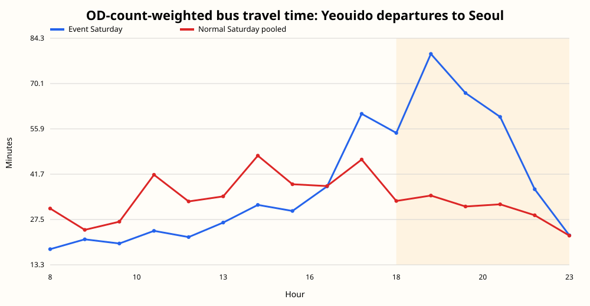
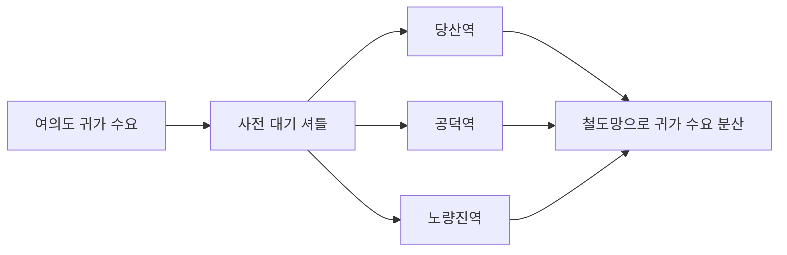

# 여의도 불꽃축제 귀가 교통 분석과 셔틀 운영 제안

**여의도 불꽃축제 귀가 교통 분석 · 서울시립대학교 교통공학과 졸업작품**

2023년 불꽃축제를 보고 돌아오는 길에 평소보다 오랜 시간이 걸렸습니다. 방문객 증가만으로 설명할 수 있는지 궁금해, 여의도를 떠나는 통행과 대중교통 이용, 버스 정차횟수를 함께 분석했습니다. 행사일 저녁에는 이용 수요가 늘면서 정차횟수는 줄었습니다. 이 불균형에 대응하는 방안으로 여의도와 외곽 철도 환승거점을 잇는 셔틀을 제안했습니다.

[결과 페이지](https://yoon-chan-hyeok.github.io/yeouido-festival-mobility-analysis/) · [분석 방법](docs/METHODOLOGY.md) · [데이터 출처](docs/DATA_PROVENANCE.md) · [주장별 근거](CLAIM_EVIDENCE_MAP.md)

[](https://github.com/yoon-chan-hyeok/yeouido-festival-mobility-analysis/actions/workflows/validate.yml)

## 어떤 판단에 쓰는 분석인가

대규모 행사 뒤 귀가 교통을 계획할 때, **어느 시간에 수요가 몰리고 그때 교통 운영은 어떻게 달라지는지** 확인하는 데 쓸 수 있습니다. 행사일과 평상시를 비교해 운영안을 검토할 근거를 만드는 사례 분석입니다. 셔틀을 실제 운행했거나 시간 절감 효과를 검증한 프로젝트는 아닙니다.

- **대상:** 2023-10-07 서울세계불꽃축제, 종료 전후인 18:00~23:59
- **범위:** 여의동 행정경계 내 대중교통 관측치와 여의도에서 서울 다른 지역으로 출발한 버스 OD(출발지·도착지 통행)
- **비교:** 정상 토요일 평균. 추석 연휴 토요일은 기본 비교에서 제외
- **산출물:** 시간대별 비교표, 공간 결합 검증표, 결과 그림과 운영 가설

## 접근 방법

수요가 늘어난 것과 교통이 충분히 운행된 것은 별개의 문제라고 봤습니다. 그래서 하나의 교통량 지표만 쓰지 않고 **수요 → 운행 → 이동 결과**를 서로 다른 자료에서 확인했습니다.

| 확인할 내용 | 사용한 자료와 이유 |
|---|---|
| 사람이 언제 몰리고 빠져나가는가 | SKT 체류인구와 OD로 체류·출발 통행의 시간대 변화를 확인 |
| 대중교통 이용은 얼마나 달라졌는가 | 버스·지하철 30분 자료를 시간 단위로 합쳐 평상시와 비교 |
| 같은 시간에 버스 운행 관측은 어떠했는가 | TPSS 정차횟수로 이용 수요와 운행 변화가 함께 나타나는지 확인 |
| 이동 결과도 달라졌는가 | OD별 통행량을 가중치로 이동시간을 계산해 적은 통행의 과도한 영향을 방지 |
| 서로 다른 자료가 같은 지역을 보고 있는가 | 행정동 GIS와 정류장 ID·이름을 결합하고 누락·중복을 별도 기록 |

OD·체류인구는 9월 2·9·16·23일과 10월 14일, 버스·지하철·TPSS는 10월 14·21·28일을 정상 토요일로 사용했습니다. 자료별 확보 기간이 달라 비교군이 완전히 같지는 않습니다. 세부 정의는 [분석 방법](docs/METHODOLOGY.md)과 [데이터 사전](docs/DATA_DICTIONARY.md)에 정리했습니다.

## 확인한 결과

**18~23시 전체로 보면 이용 수요는 늘었지만 버스 정차횟수는 줄었고, 여의도 출발 이동시간도 길어졌습니다.**

| 지표 · 18:00~23:59 | 행사일 | 정상 토요일 평균 | 변화 |
|---|---:|---:|---:|
| 서울 다른 지역행 버스 OD 가중평균 이동시간 | 64.60분 | 32.62분 | +31.99분 |
| 버스 승차 관측치 | 25,626 | 10,570.3 | +142.4% |
| 여의도 4개 역 지하철 승차 관측치 | 36,346 | 12,532.0 | +190.0% |
| TPSS 정차횟수 | 5,973 | 9,544.7 | −37.4% |


버스·지하철 수치는 **교통카드 거래내역 기반 승차 집계**입니다. 선정한 정류장·역에서 집계한 이용 건수이며, 전체 방문객이나 고유 이용자 수로 해석하지 않습니다. 자료의 정의와 집계 범위는 [데이터 출처](docs/DATA_PROVENANCE.md)에 정리했습니다. TPSS는 차량 대수가 아닌 **정류장 정차횟수**입니다. 이동시간 차이에는 두 날짜 집단의 목적지·통행 구성 차이도 포함되므로 동일 경로의 순수 지연이나 행사 자체의 인과효과로 해석하지 않습니다.

<details>
<summary>시간대별 결과와 집계 근거</summary>



전체 집계는 [actual_reanalysis_summary.json](outputs/reports/actual_reanalysis_summary.json), 시간대별 분석표는 [data/public](data/public)에 있습니다. 체류인구의 시간대 합계는 같은 사람이 중복될 수 있어 고유 방문자 수로 사용하지 않았습니다.

</details>

## 운영안: 외곽 환승거점 셔틀

여의도 내부 도로가 혼잡한 상황에서 버스만 더 투입하면 차량 정체를 키울 수 있다고 봤습니다. 행사 종료 뒤 몇 시간의 수요를 위해 정규 노선 전체를 늘리는 대신, 짧은 구간을 반복 운행해 혼잡 구역 밖의 철도망으로 연결하는 방안을 검토했습니다.

졸업작품 발표에서는 여의도 내부에 집중된 귀가 수요를 **당산·공덕·노량진역으로 옮겨 기존 철도망으로 분산**하는 방안을 제안했습니다. 거점은 여의도 혼잡 구역 밖에 있고, 철도 환승이 가능하며, 귀가 방향을 나누고 셔틀이 반복 운행할 수 있는 거리를 고려해 선정했습니다. 혼잡이 커지기 전에 셔틀을 대기시키는 운영도 함께 검토했습니다.



공개본을 재정리하면서 이 운영안의 전제를 **정차횟수 회복 stress test**로 점검했습니다. 행사일 수요를 고정하고 정차횟수만 정상 토요일 수준으로 바꿔, 정차 1회당 승차 관측치가 얼마나 남는지 계산했습니다.

```text
부담 지수 = (행사일 버스 승차 관측치 / 행사일 정차횟수)
          / (정상 토요일 버스 승차 관측치 / 정상 토요일 정차횟수)
```

관측된 부담은 평상시의 **3.87배**, 정차횟수 회복 가정에서도 **2.42배**였습니다. 이는 수요 분산을 검토할 이유를 보태는 산술적 점검입니다. 셔틀 수송 능력, 증차 효과, 최적 거점이나 시간 절감을 예측한 값은 아닙니다. [계산식·입력값](outputs/reports/supply_recovery_stress_test.json)과 [결과 그림](outputs/figures/actual_supply_recovery_stress_test.svg)을 함께 제공합니다.

## 분석 과정에서 한 판단

초기 분석에서는 지역별 교통 규모 차이를 줄이려고 **평시 첨두 대비 초과 교통량**을 만들었습니다. 초과량이 커질수록 예측 지체가 줄어들지 않도록 **Isotonic Regression**을 선택했습니다. 다만 새로운 행사에 대한 검증이 부족해, 현재 공개본에서는 이 모델의 예측 성능을 주요 결과로 내세우지 않습니다.

다섯 원자료의 공통기간은 2023-10-02부터 10-15까지 14일이며 행사 사례는 한 건뿐입니다. 현재 **다섯 자료를 한꺼번에 결합한 모델링용 비교 패널**의 공통 날짜는 행사일과 정상 토요일 하루입니다. 앞의 지표별 분석은 자료마다 확보한 여러 토요일을 사용하므로 이 패널과 날짜 범위가 다릅니다. 모델링 판단과 후속 평가 조건은 [MODEL_SELECTION.md](docs/MODEL_SELECTION.md)에 남겼습니다.

재분석에서는 토요일 비교군, 통행량 가중평균, 30분 자료의 누락 여부를 다시 확인했습니다. GIS 기준 59개 정류장 ID 중 TPSS는 54개가 연결됐고, 버스 자료는 고유 정류장명 40개 중 32개가 관측됐습니다. [결합 검증표](outputs/tables/join_audit.csv)와 [수정 이력](docs/CORRECTIONS.md)에서 범위와 처리 내역을 확인할 수 있습니다.

## 실행 방법

Python 3.10 이상. **공개 집계본으로 표·그림·결과 페이지를 다시 만드는 데 외부 패키지는 필요하지 않습니다.**

```shell
python reproduce_public.py
python -m unittest discover -s tests
python validate_release.py
```

원자료는 저장소에 포함하지 않았습니다. 원자료부터 실행하려면 [데이터 출처·파일 준비](docs/DATA_PROVENANCE.md)를 확인한 뒤 `python run_all.py`를 사용합니다.

| 경로 | 내용 |
|---|---|
| `src/`, `tests/` | 원자료 처리·분석 코드와 테스트 |
| `data/public/` | 날짜·시간대 공개 집계본 |
| `outputs/` | 분석표, 결과 그림, 결합 검증과 요약 |
| `docs/` | 분석 방법, 변수 정의, 모델 선택과 수정 이력 |
| `index.html` | 공개 집계본으로 생성한 결과 페이지 |

이 저장소가 교통 졸업작품의 최종 공개본입니다. [event-traffic-delay-analysis](https://github.com/yoon-chan-hyeok/event-traffic-delay-analysis)는 같은 프로젝트의 초기 분석·합성 데이터 파이프라인을 보존한 아카이브이며, 별도 성과로 세지 않습니다.

## 해석 범위

도로통제·우회·무정차의 영향은 분리하지 않았으며, 2017년 행정경계와 2019년 정류장 위치를 2023년 자료에 적용했습니다. 따라서 이 분석은 행사일의 수요·운행·이동시간 변화를 함께 읽는 사례입니다. 운영안의 효과를 판단하려면 실제 노선·차량·통제 자료와 추가 행사일의 검증이 필요합니다.
